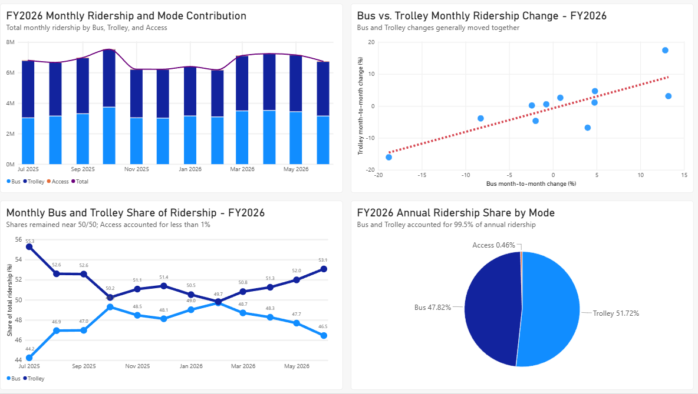

# San Diego MTS Ridership Analysis

## Project Overview

This project analyzes publicly available San Diego Metropolitan Transit System (MTS) monthly ridership data for fiscal year 2026, covering July 2025 through June 2026.

The final deliverables include a reproducible Jupyter notebook and a Power BI report that visualizaes the main findings.

## Analysis Questions

1. How does total ridership vary month to month, and which modes contribute most?
2. Did Bus and Trolley ridership move together or diverge?
3. How did mode share change throughout FY2026?
4. How much annual ridership came from each mode?

## Tools Used

- Python: data cleaning, validation, exploratory analysis, CSV export preparation
- Pandas/Numpy: aggregation, month-to-month calculations, mode comparison, and share calculations
- Jupyter Notebook: reproducible analysis workflow and documentation
- Power BI: data visualization, dashboard design, and final reporting

## Data

The `monthly-ridership-julyfy27.xlsx` dataset was sourced from the
[San Diego MTS Reports, Records and Policies page](https://www.sdmts.com/about/reports-records-and-policies).
At the time of analysis, only one month of FY2027 was available, so the complete FY2026 period was extracted for analysis.

## Analysis Workflow

The analysis focused on cleaning the FY2026 data, measuring month-to-month ridership changes, comparing Bus and Trolley ridership behavior, and examining each mode's share of total ridership. Access accounted for less than 1% of ridership throughout FY2026, so the analysis placed greater emphasis on Bus and Trolley patterns.

- Extracted and validated the complete FY2026 monthly ridership data
- Calculated total ridership and month-to-month absolute and percentage changes
- Compared Bus and Trolley ridership movement using percentage-change gaps, directional similarity, and correlation
- Calculated monthly and annual ridership shares for Bus, Trolley, and Access
- Prepared cleaned outputs for visualization in Power BI

## Key Findings

- How does total ridership vary month to month, and which transit modes contribute most to those changes?

FY2026 ridership was fairly stable in most months, with the sharpest decline in November 2025 and the strongest rebound in March 2026. Busses contributed slightly more overall to month-to-month ridership movement than Trolleys, while Access contributed very little.

---

- Did Bus and Trolley ridership move together, or were there months where they diverged noticeably?

Bus and Trolley month-to-month percentage changes had a correlation of approximately 0.812, indicating a strong positive relationship during FY2026. This supports the observation that the two modes generally moved together, although a few months—especially August 2025—showed noticeable divergence.

---

- How did each mode’s share of total ridership change throughout FY2026?

Mode share changed very little over FY2026. Busses and Trolleys consistently accounted for virtually all ridership, with Trolleys generally holding a modest majority, while Access remained below 1% throughout the year.

---

- How much of total annual ridership came from Bus vs. Trolley vs. Access?

Trolleys accounted for 51.72% of FY2026 ridership compared with 47.82% for Bus, a difference of 3.90 percentage points. Trolley ridership was about 8.2% higher than Bus ridership overall. Access accounted for just 0.46% of annual ridership.

## Power BI Report

The analysis was built into a one-page Power BI report to summarize the main FY2026 ridership findings in a compact visual format.

The report includes:
- Monthly Ridership
- Bus vs. Trolley Movement
- Monthly Mode Share
- Annual Ridership Share

The Power BI report uses cleaned CSV exports from the analysis notebook. Visuals include a stacked column and line chart for monthly ridership, a scatterplot with a trend line for Bus and Trolley percentage changes, a line chart for monthly mode share, and a pie chart for annual ridership share.

